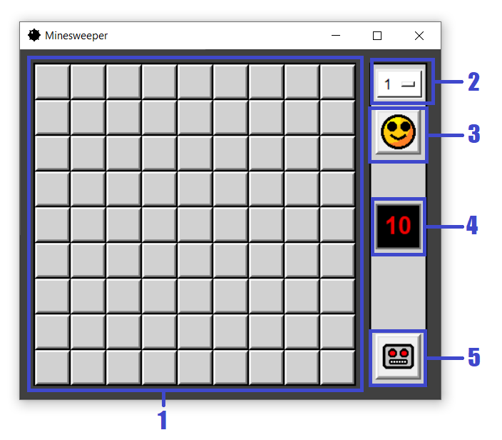
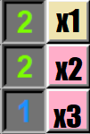

# MinesweeperAI
Minesweeper Game with built-in rule-based artificial intelligence (AI). Made with Python (ver 3.10) and Tkinter module.

## Controls

  

<ul>
  <li>1 – board</li>
  <li>2 – mode selector, available modes:
  <ul>
    <li>1 – easy mode, board size = 9×9, number of bombs = 10</li>
    <li>2 – medium mode, board size = 16×16, number of bombs = 40</li>
    <li>3 – hard mode, board size = 16×32, number of bombs = 99</li>
  </li>
  </ul>
  <li>3 – game reset button</li>
  <li>4 – cells left to flag</li>
  <li>5 – call the AI for help</li>
</ul>

For unopened cells:
<ul>
  <li>Left click = Open the cell</li>
  <li>Right click = Flag the cell</li>
</ul>
For opened cells:
<ul>
  <li>Left click = Open the cells adjacent to the clicked one if the number of adjacent flags is the same as the number inside the clicked cell</li>
</ul>
For flagged cells:
<ul>
  <li>Left click = Remove the flag</li>
  <li>Right click = Remove the flag</li>
</ul>

## About the AI

The AI is like a player – it does not know all the right moves. It can give a safe move, a risky move, or a completely random move.

To find a safe move, the AI is checking if the opened cells satisfy the conditions:
<ul>
  <li>If the number of flagged cells is the same as the number inside the cell they are adjacent to, then other adjacent cells contain no bombs.</li>
  <li>If the number of unopened cells is the same as the number inside the cell they are adjacent to (minus the number of the adjacent opened cells), then all of these unopened cells contain bombs.</li>
</ul>

If a safe move cannot be found that way, the AI checks for intersections. Consider the example below:

  
  
<i>The yellow cell is OK to flag</i>

It is clear that the cells x1, x2, x3 contain 2 bombs. Since x2 and x3 can only contain one bomb, x1 definitely contains a bomb.

If a safe move cannot be made then the AI considers all possible arrangements of bombs in the cell that are adjacent to the opened ones. Then it computes a weighted average of times when a bomb is inside each observed cell. If a cell contains a bomb in all possible arrangements, the cell is flagged. Else, the AI opens on the cell with the smallest probability of it containing a bomb.

At the beginning of the game, when no moves are made yet, the AI can only make a random move.

> [!NOTE]
> The AI does not check if the player flagged the correct cell. A wrong move will affect all the further outputs.

## Credits
The AI’s logic is based on the strategies described in <a href="https://minesweepergame.com/math/minesweeeper-a-statistical-and-computational-analysis-2004.pdf">“Minesweeper: A Statistical and Computational Analysis”</a> by Andrew Fowler and Andrew Young.

## Known issues
It takes awhile for the AI to calculate all possible moves if the opened cells are too far apart.
